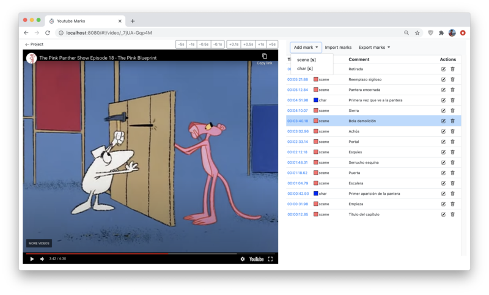

# YouTube Marks

Annotate your videos with this simple tool.

## Intro

The scenario for this tool is a user that needs to analyze videos.
This tool can help by supporting this use case:
1. Register one or more **videos** in the **project** page. Note the videos must be previously loaded in Youtube. For example, if the video URL is https://youtu.be/_7jUA-Gqp4M, the ID to register is "_7jUA-Gqp4M". 
2. Register one or more **tags** which are kinds of marks to are forseen to be added in the videos (it is enough to register just one, for example, a "default" tag). The tags can have an associated **Key binding** which must be a single letter (case-sensitive) to ease insertion during playback. Tags can also have a distinctive color.
3. Click on a video and control the playback by pressing play, pause (the space key is a key binding for toggling), moving the dot in the bar, or use the top-right button bar for high-precision seek.
4. To mark the video, there are two main possibilities:
   - via the "Add mark" dropdown, and 
   - via using the key binding of a tag previously defined.
5. To add a textual comment, click on the pencil button that's present on each row, and edit it (press the small accept button to save the changes).

#### Why YouTube?
The tool could become independent of YouTube, or at least be just an option. Maybe in the future. In our experience, it was quite practical like this. We had 16 HD videos of more than an 1 hour long; we uploaded them all one night and the day after the URLs were ready to be added to this tool.

*Tip*: We selected the YouTube's **Unlisted** visibility for the videos. It differs from the **Public** visibility in that nobody will find them with a YouTube search, and differs from **Private** visibility in that anybody with the video URL can view it.

#### Export/Import
It may be convenient for the user to export the marks on a video. This can be done to: 
  - CSV, and edit the marks in a spreadsheets office tool, or 
  - JSON, and edit the marks in a text editor or programatically by any language.
  
Those files can be imported back into the project.

#### Persistance/Versioning
The whole project (videos, tags, and marks) are persisted in the `db.json` file at the root of this repository. 

In fact, the user might manually edit this file and (re)start the server with `ctrl+c + npm start` to browse the new state.

It is convenient to regularly version the `db.json` file to some git repository to keep track of your analisis.

## How to install

1. Ensure you have [nodejs](https://nodejs.org/)
2. Clone this repository
3. Open a terminal, change directory to root (where this README.md file is) and run `npm install`.

## How to launch

1. Open a terminal, change directory to root, and run `npm start`.
2. Open browser on http://localhost:8080.

